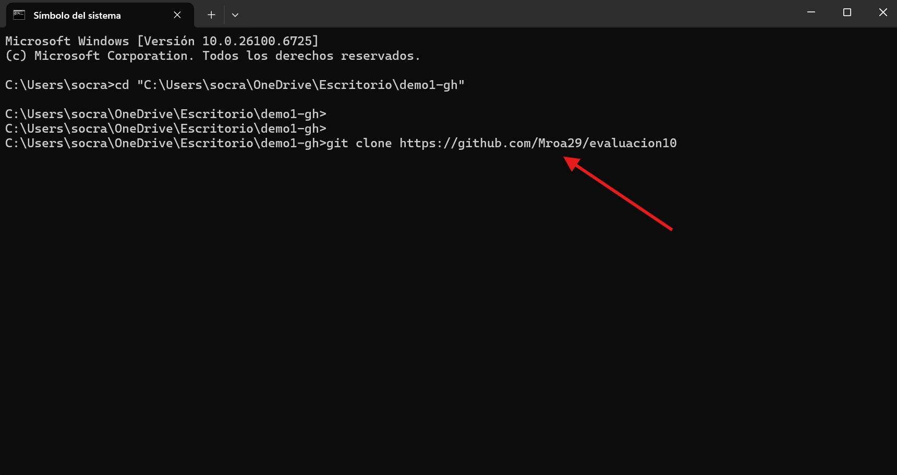
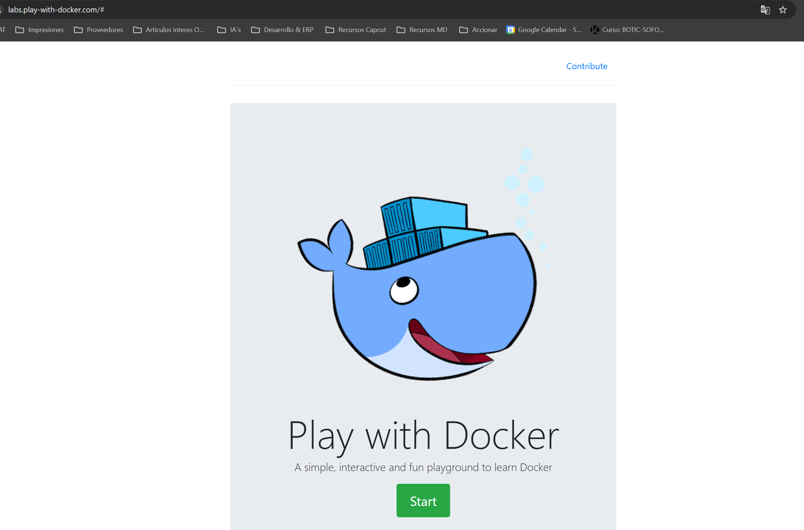
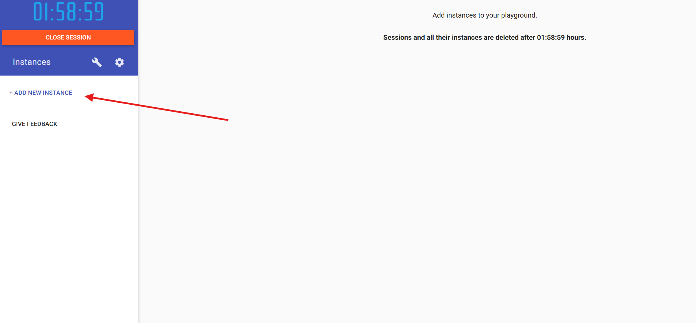
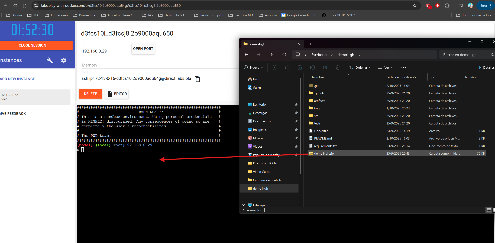
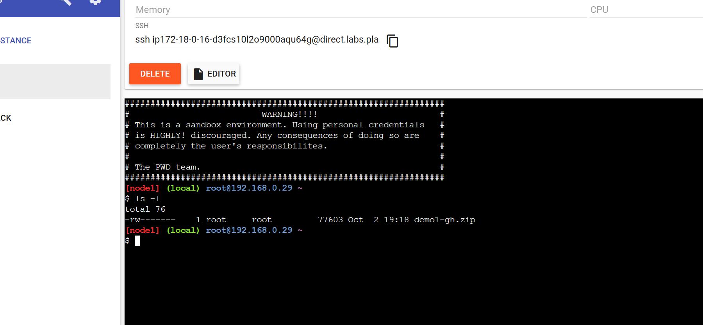
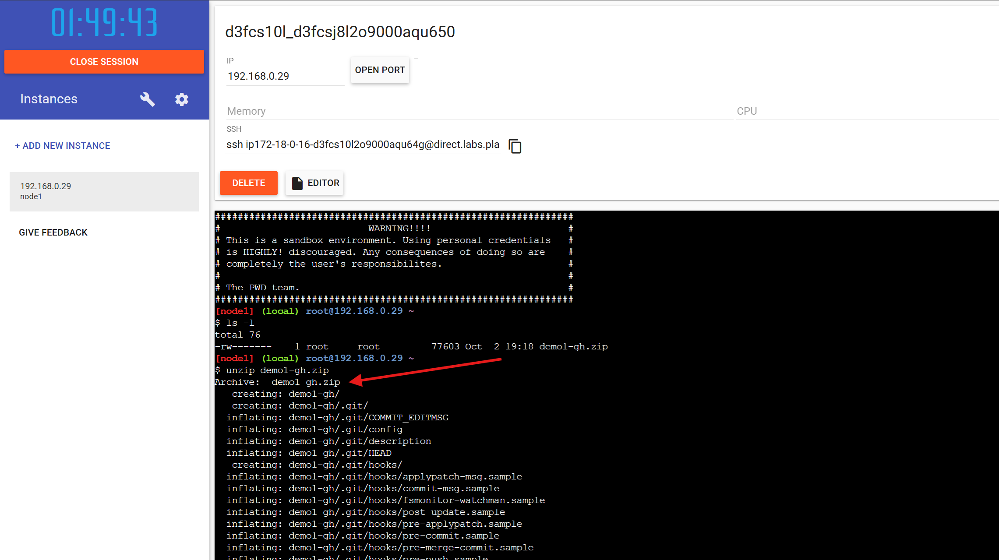
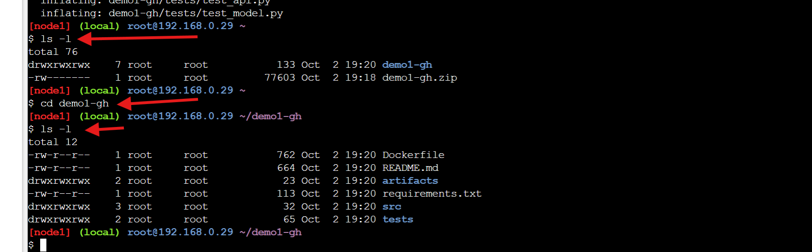
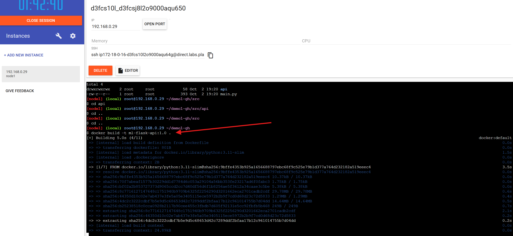
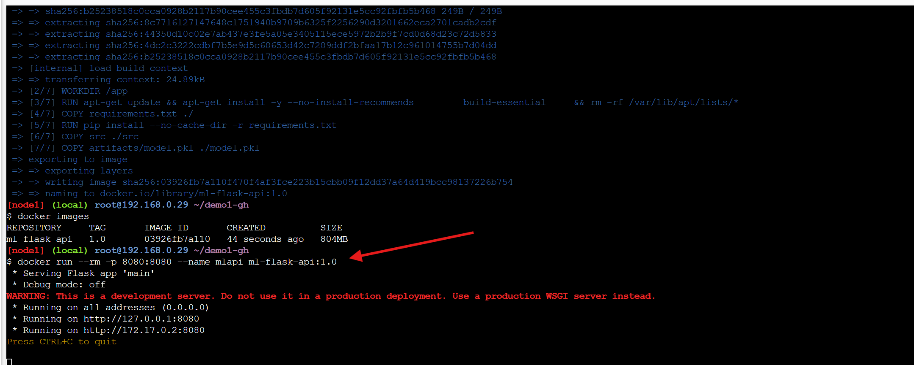
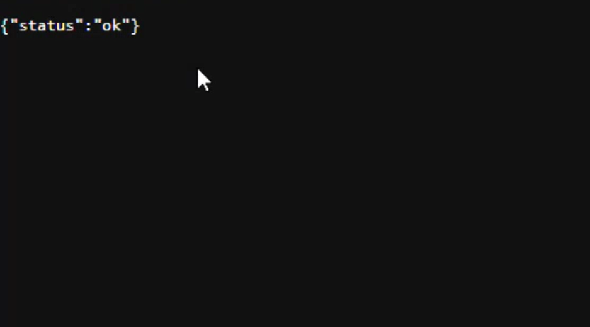

# Evaluacion modular numero 10 🫡

---

### Ademas te comento como es que puedes hacer subidas desde tu git paso a paso y como utilizar este modelo 

# El primer paso es descargar el repositorio si asi lo deseas! 

Te dejo el paso a paso 

- Crea una carpeta en tu manica en donde alojaras el repositorio 

- Cuando ya tengas creada la carpeta abre la consola con Windows + R y escribre cd "mas_la_ruta_de_tu_carpeta"
   Te dejo la imagen de ejemplo 
    

- Una vez posicionado en la carpeta usa el siguiente comando "git clone https://github.com/Mroa29/evaluacion10"
   Te dejo la imagen de ejemplo 
    

- Y lugo puedes entrar desde la consola al repositorio cd repositorio

---

### 📂 Modelo base 

El repositorio incluye un **modelo inicial** en la carpeta `artifacts/model.pkl`.  
- Este modelo es solo de **prueba** para que el contenedor arranque con predicciones disponibles de inmediato.  
- En un flujo real de **MLOps**, el modelo se **genera** y **actualiza** mediante el endpoint `/api/train` o en pipelines de CI/CD, y normalmente no se versiona dentro del repositorio.  
- Cuando ejecutes el contenedor, puedes sobrescribirlo fácilmente reentrenando con:
  ```bash
  curl -X POST http://127.0.0.1:8080/api/train -H "Content-Type: application/json" -d '{}'
  ```

---

### 📂 Ahora Si quisieras montar tu mismo la imagen en el docker te dejo el paso a paso 

- 1 Ve a siguiente pagina https://labs.play-with-docker.com/ y en ella preciona el boton Start 
  Te dejo la imagen de ejemplo 
    

- 2 Una vez dentro crea una nueva instancia .
  Te dejo la imagen de ejemplo 
    

- 3 Cuando estes dentro arrastra la carpeta zip que descargaste del repositorio al ambiente del docker 
  Te dejo la imagen de ejemplo 
    

- 4 Puedes verificarla con el comando ls -l dentro de la consola 
  Te dejo la imagen de ejemplo 
    

- 5 Como es un zip ahora toca descomprimirlo dentro del docker 
  Te dejo la imagen de ejemplo 
    

- 6 Listamos nuevamente con ls - l y veremos que nuestras carpetas estan descomprimidas, con cd y demo1-gh entramos a la carpeta y luego listamos nuevamente todo lo que hay dentro
  Te dejo la imagen de ejemplo 
    

- 7 Crearemos la imagen con el comando "docker build -t  ml-flask-api:1.0 .
  Te dejo la imagen de ejemplo 
       

- 8 Ahora toca correr la imagen para eso utilizaremos el siguiente comando "docker run --rm -p 8080:8080 --name mlapi ml-flask-api:1.0
  Te dejo la imagen de ejemplo 
       

- 9 Una vez este todo ok podremos consumir el servicio en el puerto que configuramos el 8080 
  Te dejo la imagen de ejemplo 
       