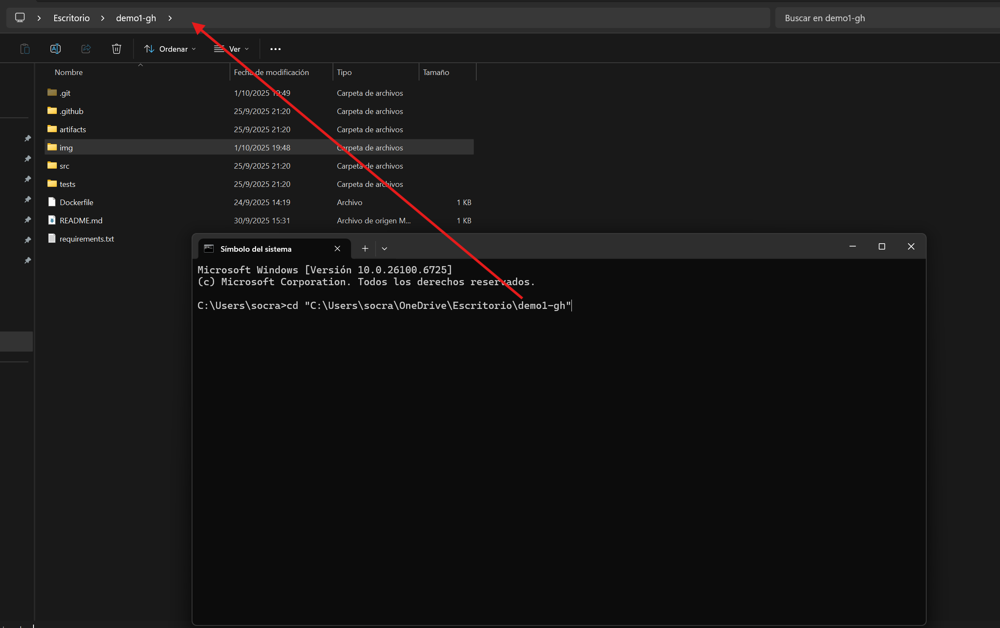

# Evaluacion modular numero 10 🫡

---

### 📂 Modelo base 

El repositorio incluye un **modelo inicial** en la carpeta `artifacts/model.pkl`.  
- Este modelo es solo de **prueba** para que el contenedor arranque con predicciones disponibles de inmediato.  
- En un flujo real de **MLOps**, el modelo se **genera** y **actualiza** mediante el endpoint `/api/train` o en pipelines de CI/CD, y normalmente no se versiona dentro del repositorio.  
- Cuando ejecutes el contenedor, puedes sobrescribirlo fácilmente reentrenando con:
  ```bash
  curl -X POST http://127.0.0.1:8080/api/train -H "Content-Type: application/json" -d '{}'
  ```

### Ademas te comento como es que puedes hacer subidas desde tu git paso a paso y como utilizar este modelo 

# El primer paso es descargar el repositorio si asi lo deseas! 

Te dejo el paso a paso 

- Crea una carpeta en tu manica en donde alojaras el repositorio 
- Cuando ya tengas creada la carpeta abre la consola con Windows + R y escribre cd "mas_la_ruta_de_tu_carpeta"
   Te dejo la imagen de ejemplo 
    
